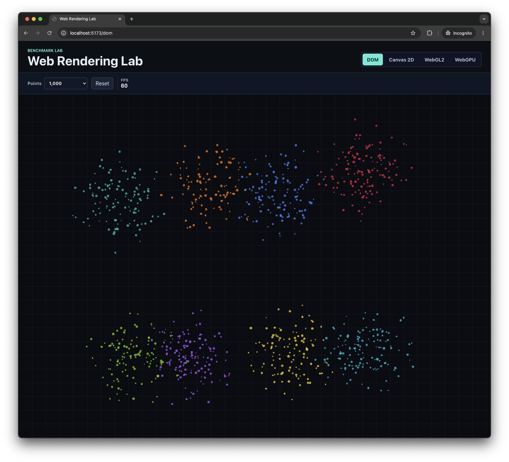
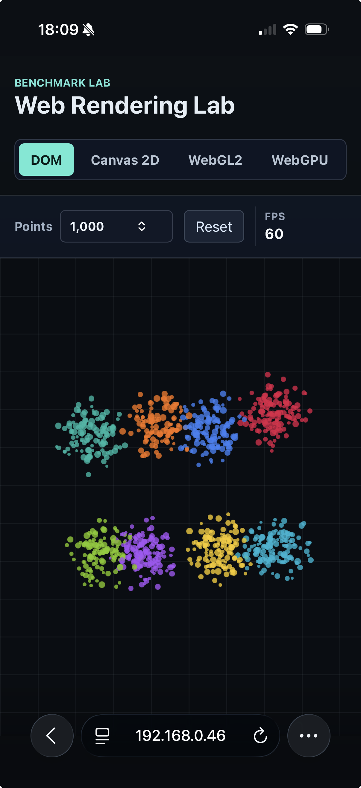

# Web Rendering Lab

> DOM vs Canvas 2D vs WebGL2 vs WebGPU

Experiments comparing rendering strategies for large-scale interactive visualizations.

## Demos

This repository includes 4 demos:

- DOM - purely DOM rendering of elements
- Canvas 2D - 2D rendering with the HTML canvas API
- WebGL2 - de-facto standard for performant GPU rendering in browsers
- WebGPU - new standard for performant 2D rendering

Each demo renders the same deterministic scatterplot with shared pan, zoom, point-count controls, and FPS metrics.

## Preview

| Desktop | Mobile |
| --- | --- |
|  |  |

## Run

```sh
npm install
npm run dev
```

Open:

[http://localhost:5173](http://localhost:5173)

## Deploy

GitHub Pages deploys from `main` with GitHub Actions:

[https://luciomartinez.github.io/web-rendering-lab/](https://luciomartinez.github.io/web-rendering-lab/)

## Check

```sh
npm run typecheck
npm run build
npm test
```
